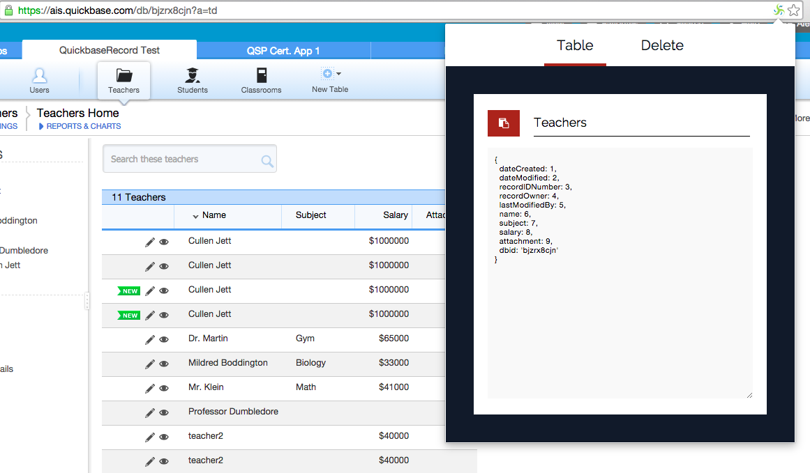
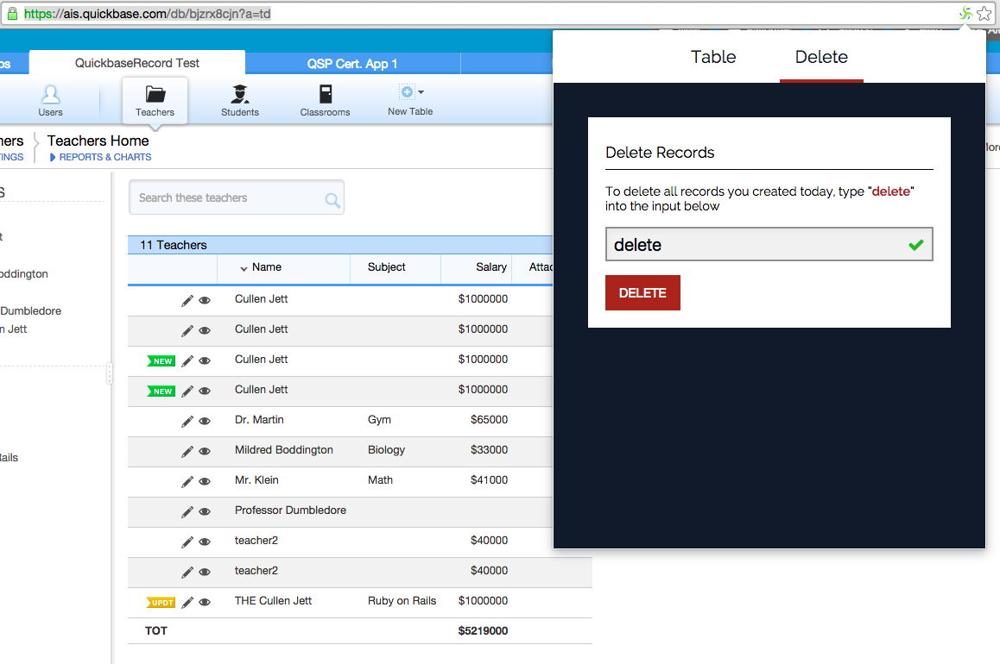

# QuickConfig Chrome Extension

QuickConfig is an extension for QuickBase developers to easily create configuration objects for QuickBase tables.

## Usage

First, download the extension from the Chrome store. Then any time you visit a "*.quickbase.com" website you'll see the QuickConfig icon in the omnibox (the Chrome search input). Click the icon to open the extension.

**IMPORTANT** You must be on a table-specific URL for the extension to work correctly. It will not work from the main dashboard.

### Table Config

While on a specific table URL, click the icon to open the extension and you'll see a javascript object representation of the field names => field IDs. You can click the 'copy' button to add the contents to your clipboard.

### Delete Records

QuickConfig also allows you to delete any records in the current table that were created 'today' by the current user (you). On the 'Delete' tab, enter the word 'delete' in the input box and click the button to delete those records.

### Screenshots

